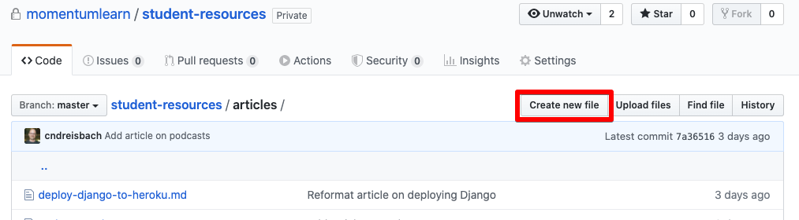

# How to contribute to this knowledge base

If you are a Momentum student, alum, or staff member, we want your contributions here! Find the section below that applies to your situation.

## I have a question I need answered

If you have a question and don't have an answer, we want you to [file an issue](https://github.com/momentumlearn/student-resources/issues/new?assignees=&labels=question&template=new-question.md&title=). We ask you to start with what problem you are trying to solve -- sometimes the question you think you have might change as we investigate the issue.

## I have an article I want posted

If you've written an article, the most straightforward way to get it into this knowledge base is to fork this repo, make your changes to your fork, and then send us a pull request. If you want to go it even quicker, though, you can click the "Create new file" button under [articles/](https://github.com/momentumlearn/student-resources/tree/master/articles).

