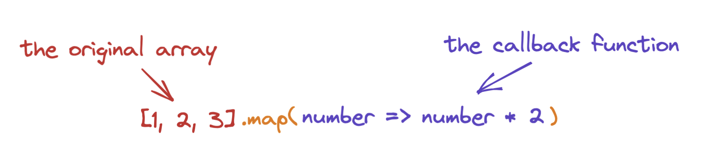

# JS for React

React is a JavaScript library that provides a way to design user interfaces and manage data using a pattern of composable "components". We use regular Javascript and some special functions built into React to describe how we want parts of our UI to look, and React takes care of making changes to the DOM to match what we want.

To work with React, it really helps to be comfortable with certain features of JavaScript. Here's a list, with examples, of what you should be able to recognize and use when writing React code.

---

## Template Literals

The template literal syntax is a way to compose strings with bits that are evaluated by JavaScript. It's a more concise alternative to string concatenation (appending strings one after another).

```js
// with string concatenation
const greeting = (name) => 'Welcome back, ' + name + '!'

// same exact return value, but using template literals -- notice the backticks
const greetingAlt = (name) => `Welcome back, ${name}!`

console.log(greeting('Lee'))
// logs 'Welcome back, Lee!"

console.log(greetingAlt('Lee'))
// logs 'Welcome back, Lee!"
```

---

## Shorthand Property Names

This is a shorter way to make an object when you're using variables to assign values to keys. If you name the keys the same as the variables, you can use this shorthand syntax.

```js
// the old way to create a new object with existing values, when we don't really need to rename them
function formatAddress(number, street) {
  const addressInfo = {
    number: number,
    street: street,
  }
  // ...do other stuff
}

// with the shorthand syntax
function formatAddress(number, street) {
  const addressInfo = { number, street }
  // this gives me the same object with the same keys and values as above
  // ...do other stuff
}
```

---

## Arrow Functions

Arrow function syntax gives us another way to declare functions without using the function keyword. They are especially useful for anonymous functions and short one-liners. When using arrow functions, it's important to declare the functions before you want to use them (which you don't have to do with the function keyword syntax because of a feature called _hoisting_).

```js
// conventional function keyword syntax to declare a function
function addOne(num){
  return num + 1
}
addOne(5) // returns 6

// arrow function syntax
// has an implicit return, which means we can leave out the "return" keyword
const addOne = (num) => num + 1
addOne(5) // returns 6

// You could also omit the parens around the parameter like so
const addOne = num => num + 1
addOne(5) // returns 6

// But that would not work if you had more than one parameter
const add = num, addToNum => num + addToNum // WRONG! Throws an error
// With more than one parameter you need the parens
const add = (num, addToNum) => num + addToNum

// This is really nice when you want to write a callback function
const incrementedScores = scores.map(num => num + 1)

// more examples!
// What if we have to do more stuff than we can fit on one line?
// If we want to take advantage of the implicit return, we need to use parens around the function body
const greetByGroup = (names, firstLetter) => (
  names.filter(name => name[0].toLowerCase() === firstLetter.toLowerCase())
       .map(name => `You're in the ${firstLetter.toUpperCase()} group, ${name}!`)
)

// You can use curly brackets around the arrow function body,
// but if you do, you can't have implicit return, so you need to use the return keyword.

// This will just return undefined
const double = (num) => {
  num * 2
}

// To get back the value we want we'll need to use the return keyword if we use the curly brackets
const double = (num) => {
  return num * 2
}

// we could omit the return keyword if we just replace the curly brackets with parens!
// you'll see this syntax a lot in React
const double = (num) => (
  num * 2
)

// As a one liner...
const double = num => num * 2

```

---

## Destructuring

This is a shorthand syntax useful when we want to make variables by extracting data from inside an object or inside an array. We can reach in and grab those values and assign them to a variable in one concise step.

### Object destructuring

```js
const pet = {
  name: 'Belletrix',
  type: 'dog',
  color: 'black',
}

// If we want to make variables using the values inside an object, we can do this:
const name = pet.name
const type = pet.type

// BUT! Destructuring syntax lets us do this instead:
const { name, type } = pet // notice those weird curly brackets! That's the destructuring syntax
// This says, get the values out of the object with these keys and assign them to variables with the same name

console.log(name) // -> returns "Belletrix"
console.log(type) // -> returns "dog"

// this works with nested objects too!
const customer = {
  name: {
    title: 'dr',
    first: 'sophia',
    last: 'burns',
  },
  location: {
    street: {
      number: 4339,
      name: 'Green Rd',
    },
    city: 'Great Falls',
    state: 'Alabama',
    country: 'United States',
    postcode: 66032,
    coordinates: {
      latitude: '11.2090',
      longitude: '139.7209',
    },
  },
}

const { city, state } = customer.location
console.log(city) // -> returns "Great Falls"
console.log(state) // -> returns "Alabama"

// You can rename those variables if you want to and still use destructuring

const { city: customerCity, state: customerState } = customer.location
console.log(customerCity) // -> returns "Great Falls"
console.log(customerState) // -> returns "Alabama"
```

### Array Destructuring

Same idea as in object destructuring. Array destructuring is a shorthand syntax to pull values out of an array and assign variable names to them.

```js
const productDetails = ['t-shirt', 'M', 'green']
const [item, size, color] = productDetails
console.log(item) // "t-shirt"
console.log(size) // "M"
console.log(color) // "green"

// this could be really useful if you have comma-separated values in a string that you want to handle separately
let birthplace = 'Tupelo, MS'
birthplace = birthplace.split(',')
const [city, state] = birthplace
console.log(city) // "Tupelo"
console.log(state) // "MS"

// What if you have more items in the array than variable names? No worries.
// Just destructure however many you want and JS will just ignore the rest
const pets = ['Nutmeg', 'Garvey', 'Roxie Jane', 'Belletrix']
const [alphaDog] = pets // this returns just the first one
console.log(alphaDog) // "Nutmeg"
```

---

## What's up with the three dots `...`

The three dots `...` takes on different meanings depending on the context. Sometimes it's acting as the "rest" operator and sometimes it's acting as the "spread" operator.

### Rest Operator

The rest operator gives us a way to capture the "rest" of an array or object.

When we use the three dots `...` this way, we call it the rest operator.

```js
// Let's continue using our example from above.
const pets = const pets = ['Nutmeg', 'Garvey', 'Roxie Jane', 'Belletrix']
// what if you want the first one AND the rest of the dogs?
const [alphaDog, pack] = pets // Nope! That won't work
console.log(alphaDog) // "Nutmeg"
console.log(pack) // "Garvey"
// if we want ALL the rest of the dogs we can use the "rest operator"
const [alphaDog, ...pack] = pets
console.log(alphaDog) // "Nutmeg"
console.log(pack) // ["Garvey", "Roxie Jane", "Belletrix"]
```

### Spread Syntax

Still the three dots! We can use the three dots to take existing arrays and "spread them" into another array _without creating a nested array_.

```js
const newFriends = ['Ida', 'Zadie', 'Isabel']
const oldFriends = ['Aidan', 'Liam', 'Evie']
// Think about how you would combine these arrays. splice()? concat()? push()? UGH.
// The spread operator makes this very simple and easy to read!
const allFriends = [...oldFriends, ...newFriends]
// If we wanted to add another friend in there it's also super simple
const moreFriends = [...oldFriends, 'Julius', ...newFriends]
```

The spread syntax can also be used to copy an array (a nice alternative to `slice()`).

```js
let instruments = ['cello', 'viola', 'violin']
let copyOfInstruments = [...instruments]
```

#### Spread syntax works with objects too!

```js
const employee = {
  name: 'Lisa',
  city: 'Chapel Hill',
  state: 'NC',
}

const hireData = {
  jobTitle: 'QA Engineer',
  department: 'Engineering',
}

const employeeRecord = { ...employee, ...hireData, startDate: 'June 1, 2021' }
console.log(employeeRecord)
// {
//  name: 'Lisa',
//  city: 'Chapel Hill',
//  state: 'NC',
//  jobTitle: 'QA Engineer',
//  department: 'Engineering',
//  startDate: 'June 1, 2021'
// }
```

---

## Ternary Operator

This is an alternative to the `if...else` conditional syntax. It's "ternary" because it has three parts. The structure works like this:

`ifThisConditionIsTrue ? thenThis : otherwiseThat`

```js
// with a regular old if...else
function loadingMessage(isLoading) {
  if (isLoading) {
    return 'Loading...'
  } else {
    return ''
  }
}

// with a ternary we can write it this way
function loadingMessage(isLoading) {
  return isLoading ? 'Loading...' : ''
}
```

---

## `map()`

You'll use this all the time in React when you want to show lists of things. It's an array method that is useful when you have an array that you want to transform into a new array.

This method takes an argument that is a function. Usually you'll see it as an arrow function, but it would work with the `function` keyword as well.

`.map()` will loop through the array for you. Its function (the one you pass as an argument to `.map()`) will be called for each item in the array, using that item as an argument. The body of the function can use that argument to produce and return a new value. That value is added to a new array, which is returned by `.map()`, leaving the original array unchanged.



```js
[1, 2, 3].map(number => number * 2)
// on the first iteration the function will run with 1 as the argument and return 2
// on the second iteration the function will run with 2 as the argument and return 4
// on the third iteration the function will run with 3 as the argument and return 6
> [2, 4, 6]
```

It works with variables and other data types, too.

```js
const exclamations = ["hey", "whoa", "awesome"]
const shouts = exclamations.map(word => word.toUpperCase() + "!")
console.log(shouts)
> ['HEY!', 'WHOA!', 'AWESOME!']
```

---

## ES6 Modules and Import/Export

A module is JavaScript code organized into its own separate file and set up so that it can be easily included in other JavaScript files when we want to use it(and not included if we don't need it).

The way we allow code to be included in other files is with the `import` and `export` keywords.

You import functions and classes from other files when you need to use it in your file (it needs to be in scope there). For it to be imported, it has to be exported from somewhere else.

The syntax can be confusing. Here are the basics of what you need to know.

### Default Exports

You can use the "default" syntax if you are exporting only ONE thing (like a function, a class, or a React component) from your file.

```js
// in Menu.js
// as an arrow function
const Menu = () => <h1>Daily Specials</h1>

// OR with the function keyword
function Menu(){
  return <h1>Daily Specials</h1>
}

// at the bottom of the Menu.js file
export default Menu

// in another file, at the top
import Menu from ‘./components/Menu’
```

You could also put the keywords right in front of the function or component you're exporting instead of at the bottom, but only with the function keyword:

```js
// in Menu.js
// you can't do it this way with an arrow function!
export default function Menu() {
  return <h1>Daily Specials</h1>
}

// in another file, at the top
import Menu from ‘./components/Menu’
```

### Named Exports

Sometimes you have more than one thing to export from a file. In that case you want named exports. This matters because it changes the syntax you use to import them.

```js
// in Planets.js
export const Mars = () => <h1>The Red Planet</h1>

export const Venus = () => <h1>The Evening Star</h1>

// in another file, at the top
import { Mars, Venus } from './components/Planets'
```

You can also import only one component this way!

```js
import { Mars } from './components/Planets'
```

### `{}` ❓❓❓

OK, but when do I need the curly brackets around stuff I want to import and when do I not need them? 😕

#### Are you importing a **default export?**

❌ You do NOT need `{}` around the import name.

#### Are you importing something that is **not a default?**

✅ You DO need the `{}` around the import name.

#### How do I know if I am using a default or named export?

You have to go look at the file, or rely on the documentation if you are using a library.

---
