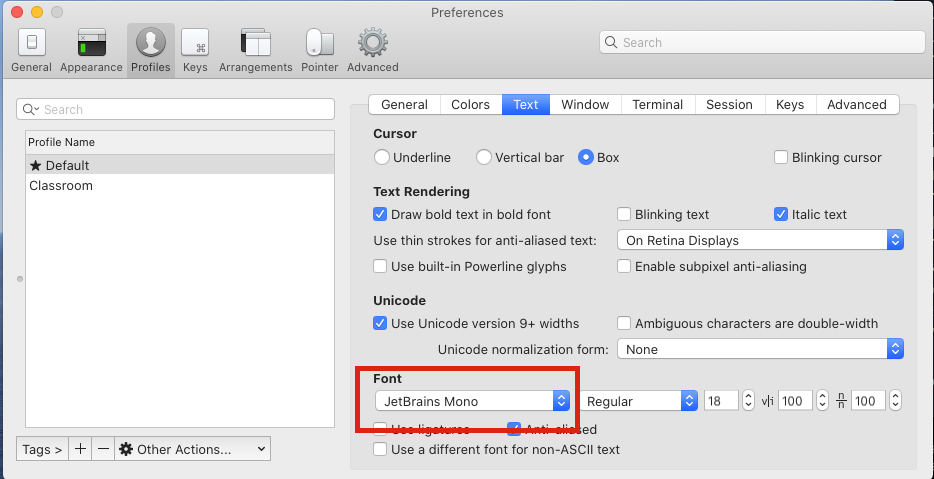

# Add a font to fix the symbols in your terminal

You should have installed the [Starship prompt](https://starship.rs/) as part of setting up your computer for class. This utility customizes the appearance of your command line prompt.

In your terminal, you may have a missing symbol before your branch name, like below:

To fix this, you'll need to add a font that contains these symbols. The easiest one to get and install is [JetBrains Mono](https://www.jetbrains.com/lp/mono/). Read the installation instructions on that site to get it installed.

To then change the font you are using in iTerm, go to the preferences and find JetBrains Mono in your profile. Your preferences screen should look like the following:

And you should be good to go.

If you're interested in checking out other monospace fonts that can display glyphs and symbols, there's always [Nerd Fonts](https://www.nerdfonts.com/).
